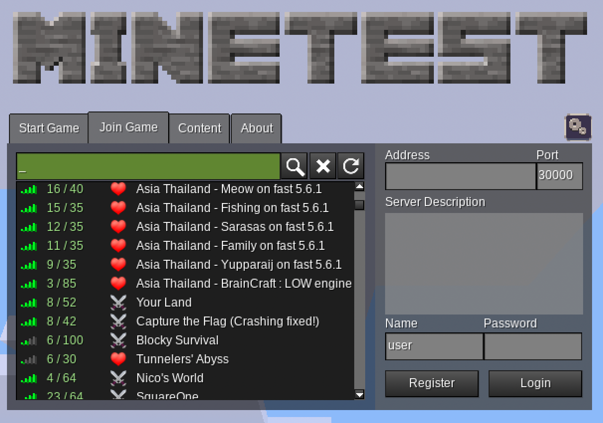

## How to join the game server?

You need to have the Minetest game platform (and only that) installed on your computer and then enter the server details to join. In details:

1. **Download and install:** Download the game from [Downloads - Minetest](https://www.minetest.net/downloads/) (and only from here!), the installation method can be different depending on your computer’s system. You only need to install the base system, when you connect to the server, the game itself will be installed automatically.

\

1. On **Windows** you simply extract the whole package into a folder (should be automatic when clicking on the zip file), then minetest.exe can be found in the bin/ subfolder. Just click on it to start the game. No install process is necessary, just giving permission to run the program.

2. On **Mac**, you need to Ctrl-click to properly Open it, and give permission to run the app.

3. On **Android** it is easy to install the game from the Play Store, [Minetest - Apps on Google Play](https://play.google.com/store/apps/details?id=net.minetest.minetest)

4. On **Linux** your distro may just have it in its package manager. If not, use [Flatpak](https://flathub.org/apps/net.minetest.Minetest), or [Snapcraft](https://snapcraft.io/minetest).

2) Start the Minetest application. Choose the tab **Join Game** and you will get the following dialog. (The image is just an illustration, not a real address.)

3) **Connect** Put in the **address** and the **port.** 

4) **Register** your user. Choose a good password, but do not use the one that you use elsewhere. Passwords cannot be empty. 

5) Once you register, you can **log in** and enter the world. Days and nights in the Minetest world have shorter cycles, but you can enter the world in the middle of the night, so it could be very dark.

6) After registration, you can **walk and talk** in the world, but if you want to build and interact with the environment, then you need to **authenticate** by sending an email to egri-nagy at aiu.ac.jp from your AIU account with your username in the game. Then I can grant you the interaction privilege. In other words, you can visit freely, but changing the world  is for authenticated AIU community members only.

7) **Explore and build.** Check the controls: [Controls - Minetest Wiki](https://wiki.minetest.net/Controls)

If there is any problem, contact **WatchKeeper** in the game, or Attila Egri-Nagy in real life.
